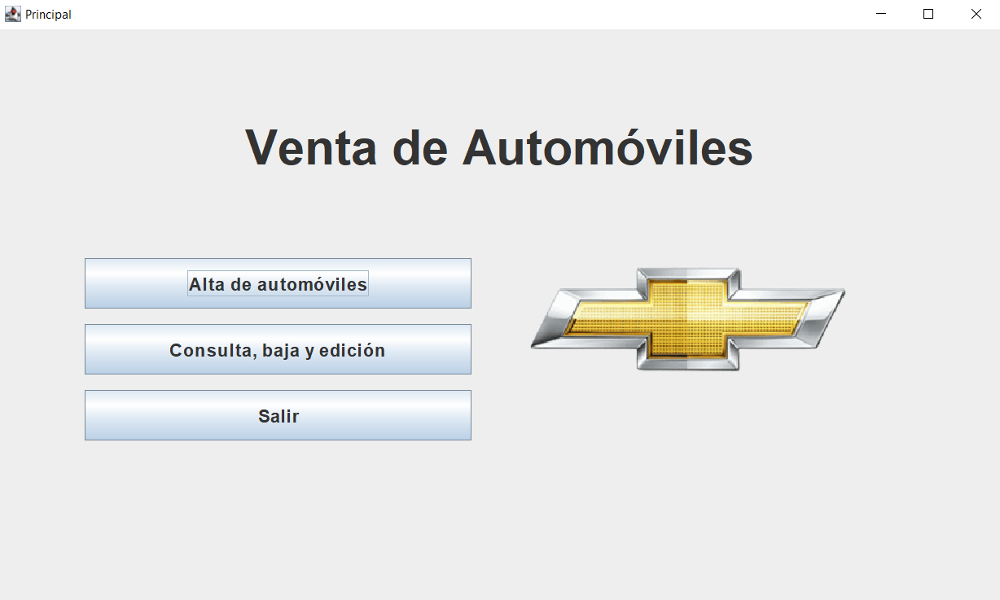

# Concesionario de autos

Este sistema permite consultar, dar de alta, editar y eliminar (CRUD) automóviles de un concesionario.

## Tecnologías utilizadas

- Java 17
- JPA
- Eclipse
- MySQL
- Java Swing (UI)

## Instrucciones para ejecutar la aplicación

### 1. Clonar el repositorio

```bash
git clone https://github.com/SeguOostdijk/Concesionario-de-Autos.git
cd Concesionario-de-Autos
```

### 2. Crear una base de datos MySQL

```sql
CREATE DATABASE concesionario_db;
```

### 3. Configurar credenciales

Abrí el archivo persistence.xml, ubicado en `src/META-INF/persistence.xml`, y completá los datos reales de tu entorno:

```xml
<property name="jakarta.persistence.jdbc.url" value="jdbc:mysql://localhost:3306/"concesionario_db"/>
<property name="jakarta.persistence.jdbc.user" value="tu_usuario"/>
<property name="jakarta.persistence.jdbc.password" value="tu_contraseña"/>

```

### 4. Compilar y ejecutar la aplicación

Desde consola o tu IDE:

```bash
mvn clean compile
mvn exec:java -Dexec.mainClass="com.mycompany.Main"
```
Al ejecutar la aplicación, se mostrará la interfaz gráfica de usuario, a través de la cual se podrá probar la aplicación.

## Preview de la ventana principal



## Autor

Segundo Oostdijk  
Desarrollador Backend  
Proyecto Concesionario de Autos - Curso de Programación Orientada a Objetos con Java - TodoCode
